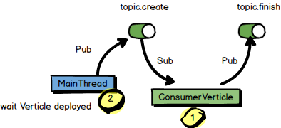

# event-bus

## Example04



在``Example04.java``中，有一个``verticle``从``topic.create``获取消息，紧接着被触发向``topic.finish``写入消息。主线程会先给``topic.create``发送一条消息，但是主线程发送消息前，``verticle``必须已经部署好，否则消息发出去，却不能触发连锁反应。

### 异步部署``verticle``

``` java
public static void main(String[] args) {
		Future<Vertx> deploymentFuture = ExampleUtil.deployVerticle(new Example04());

		//We need to send an endpoint once the verticle has been deployed so we create a custom handler on the deployment process
		deploymentFuture.setHandler(ar -> {
			EventBus eventBus = ar.result().eventBus();

			//Publish a message that will be managed by the verticle
			eventBus.publish("customer.create", new JsonObject().put("name", "ben"));
		});
	}
```

如上代码，部署成功后，返回``deploymentFuture``，在Handler中回调，以确保部署成功后才开始向``event-bus``中发送消息。

##

``` java
import io.vertx.core.AbstractVerticle;
import io.vertx.core.Future;
import io.vertx.core.Vertx;

public class EventBusExample {

	public static class PubVerticle extends AbstractVerticle {

		@Override
		public void start(Future<Void> startFuture) throws Exception {
			System.out.println("PubVerticle start(Future) in: " + Thread.currentThread().getName());

			vertx.setPeriodic(1000L, tm -> {
				System.out.println("pub in thread: " + Thread.currentThread().getName());
				vertx.eventBus().publish("exchange", "Hello");

			});
			startFuture.complete();

		}

	}

	public static class SubVerticle extends AbstractVerticle {

		@Override
		public void start() throws Exception {

			vertx.eventBus().consumer("exchange", msg -> {
				System.out.println("\tconsume: " + msg.body() + " in thread: " + Thread.currentThread().getName());
			});

			System.out.println("SubVerticle start() in: " + Thread.currentThread().getName());
		}

	}


	public static void main(String[] args) throws Exception {
		Vertx vertx = Vertx.vertx();
		vertx.deployVerticle(new PubVerticle());
		vertx.deployVerticle(new SubVerticle());
	}

}

```
