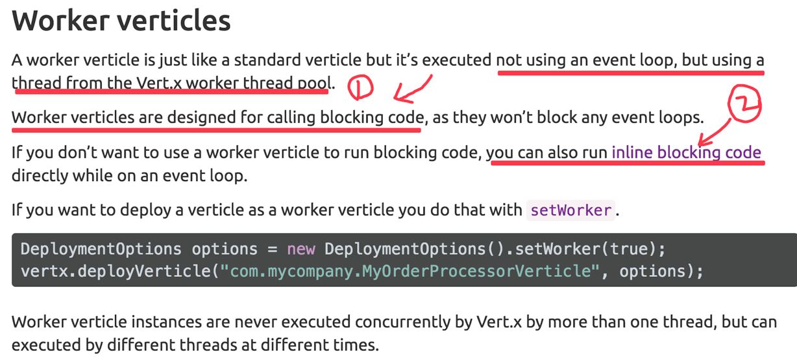

# verticle types

- Standard verticles

>These are the most common and useful type - they are always executed using an ``event loop thread``. We’ll discuss this more in the next section.

最重要的是：``Standard verticles`` 事件的处理是在 ``event loop`` 线程里面执行的。

- Worker Verticles

>These run ``using a thread from the worker pool``. An instance is never executed concurrently by more than one thread.

相比``Standard verticles``最重要的是：事件的处理是在``worker``线程里面执行的，不占用``event loop``线程。

## 颠覆观念

- ``verticle types`` 不是真的 ``type``，只是部署参数

刚开始我以为``Standard verticles``是直接继承``AbstractVerticle``的，想着``Worker Verticle``，大概是继承``AbstractWorkerVerticle``的，或者是``new MyVerticle().setType(TYPE_WORKER);``设置类型属性为WORKER。没想到，它只是一个部署选项：``vertx.deployVerticle(new MyStandardVerticle(), new DeploymentOptions().setWorker(true));``，只要部署选项是``setWorker=true``即可。压根跟``verticle``数据类型没有关系。

- 执行``blocking code``有两种方式：一种是``vertx.executeBlocking()``，另一种就是``Worker Verticle``。


``` java
vertx.executeBlocking(future -> {
  // Call some blocking API that takes a significant amount of time to return
  String result = someAPI.blockingMethod("hello");
  future.complete(result);
}, res -> {
  System.out.println("The result is: " + res.result());
});
```



>两种方式都可以用来执行阻塞代码：
- 一种是 ``vertx.executeBlocking();``
- 另一种是 ``worker verticles``。


## 线程堆栈

### 实验代码

``` java
public class MyStandardVerticle extends AbstractVerticle {

		@Override
		public void start() throws Exception {
			super.start();
			LOG.info("MyStandardVerticle start() in Thread:  {} " + Thread.currentThread().getName());
		}

		@Override
		public void stop() throws Exception {
			super.stop();
			LOG.info("MyStandardVerticle stop in Thread:  {} " + Thread.currentThread().getName());
		}

	}


  public static void main(String[] args) throws Exception {
		Vertx vertx = Vertx.vertx();
		boolean isWorkerMode = true; // true or false
		vertx.deployVerticle(new MyStandardVerticle(), new DeploymentOptions().setWorker(isWorkerMode));
  }  
```

### Standard 模式

在 ``Standard verticles`` 模式下，我们会看到 ``Selector`` 和 ``event loop``线程。

``` java

"vert.x-eventloop-thread-5" #16 prio=5 os_prio=31 tid=0x00007fd094837000 nid=0x5203 runnable [0x000070000df0f000]
   java.lang.Thread.State: RUNNABLE
        at sun.nio.ch.KQueueArrayWrapper.kevent0(Native Method)
        at sun.nio.ch.KQueueArrayWrapper.poll(KQueueArrayWrapper.java:198)
        at sun.nio.ch.KQueueSelectorImpl.doSelect(KQueueSelectorImpl.java:103)
        at sun.nio.ch.SelectorImpl.lockAndDoSelect(SelectorImpl.java:86)
        - locked <0x0000000795cad8e8> (a io.netty.channel.nio.SelectedSelectionKeySet)
        - locked <0x0000000795cad820> (a java.util.Collections$UnmodifiableSet)
        - locked <0x0000000795cad700> (a sun.nio.ch.KQueueSelectorImpl)
        at sun.nio.ch.SelectorImpl.select(SelectorImpl.java:97)
        at io.netty.channel.nio.NioEventLoop.select(NioEventLoop.java:622)
        at io.netty.channel.nio.NioEventLoop.run(NioEventLoop.java:310)
        at io.netty.util.concurrent.SingleThreadEventExecutor$2.run(SingleThreadEventExecutor.java:112)
        at java.lang.Thread.run(Thread.java:745)

"vert.x-eventloop-thread-3" #14 prio=5 os_prio=31 tid=0x00007fd094836800 nid=0x5003 runnable [0x000070000de0c000]
   java.lang.Thread.State: RUNNABLE
        at sun.nio.ch.KQueueArrayWrapper.kevent0(Native Method)
        at sun.nio.ch.KQueueArrayWrapper.poll(KQueueArrayWrapper.java:198)
        at sun.nio.ch.KQueueSelectorImpl.doSelect(KQueueSelectorImpl.java:103)
        at sun.nio.ch.SelectorImpl.lockAndDoSelect(SelectorImpl.java:86)
        - locked <0x0000000795ca8478> (a io.netty.channel.nio.SelectedSelectionKeySet)
        - locked <0x0000000795ca83b0> (a java.util.Collections$UnmodifiableSet)
        - locked <0x0000000795ca8290> (a sun.nio.ch.KQueueSelectorImpl)
        at sun.nio.ch.SelectorImpl.select(SelectorImpl.java:97)
        at io.netty.channel.nio.NioEventLoop.select(NioEventLoop.java:622)
        at io.netty.channel.nio.NioEventLoop.run(NioEventLoop.java:310)
        at io.netty.util.concurrent.SingleThreadEventExecutor$2.run(SingleThreadEventExecutor.java:112)
        at java.lang.Thread.run(Thread.java:745)

"vert.x-eventloop-thread-1" #12 prio=5 os_prio=31 tid=0x00007fd093994800 nid=0x4e03 runnable [0x000070000dd09000]
   java.lang.Thread.State: RUNNABLE
        at sun.nio.ch.KQueueArrayWrapper.kevent0(Native Method)
        at sun.nio.ch.KQueueArrayWrapper.poll(KQueueArrayWrapper.java:198)
        at sun.nio.ch.KQueueSelectorImpl.doSelect(KQueueSelectorImpl.java:103)
        at sun.nio.ch.SelectorImpl.lockAndDoSelect(SelectorImpl.java:86)
        - locked <0x0000000795ca3168> (a io.netty.channel.nio.SelectedSelectionKeySet)
        - locked <0x0000000795ca30a0> (a java.util.Collections$UnmodifiableSet)
        - locked <0x0000000795ca2f80> (a sun.nio.ch.KQueueSelectorImpl)
        at sun.nio.ch.SelectorImpl.select(SelectorImpl.java:97)
        at io.netty.channel.nio.NioEventLoop.select(NioEventLoop.java:622)
        at io.netty.channel.nio.NioEventLoop.run(NioEventLoop.java:310)
        at io.netty.util.concurrent.SingleThreadEventExecutor$2.run(SingleThreadEventExecutor.java:112)
        at java.lang.Thread.run(Thread.java:745)

"vertx-blocked-thread-checker" #10 daemon prio=5 os_prio=31 tid=0x00007fd0948e3800 nid=0x4c03 in Object.wait() [0x000070000dc06000]
   java.lang.Thread.State: TIMED_WAITING (on object monitor)
        at java.lang.Object.wait(Native Method)
        - waiting on <0x0000000795abe2b8> (a java.util.TaskQueue)
        at java.util.TimerThread.mainLoop(Timer.java:552)
        - locked <0x0000000795abe2b8> (a java.util.TaskQueue)
        at java.util.TimerThread.run(Timer.java:505)

```

### Worker 模式

在 ``Worker Verticle`` 模式下，线程堆栈：

``` java
"vert.x-worker-thread-0" #21 prio=5 os_prio=31 tid=0x00007ff50d90f800 nid=0x4f03 waiting on condition [0x000070000b8d8000]
   java.lang.Thread.State: WAITING (parking)
        at sun.misc.Unsafe.park(Native Method)
        - parking to wait for  <0x0000000795cbe068> (a java.util.concurrent.locks.AbstractQueuedSynchronizer$ConditionObject)
        at java.util.concurrent.locks.LockSupport.park(LockSupport.java:175)
        at java.util.concurrent.locks.AbstractQueuedSynchronizer$ConditionObject.await(AbstractQueuedSynchronizer.java:2039)
        at java.util.concurrent.LinkedBlockingQueue.take(LinkedBlockingQueue.java:442)
        at java.util.concurrent.ThreadPoolExecutor.getTask(ThreadPoolExecutor.java:1067)
        at java.util.concurrent.ThreadPoolExecutor.runWorker(ThreadPoolExecutor.java:1127)
        at java.util.concurrent.ThreadPoolExecutor$Worker.run(ThreadPoolExecutor.java:617)
        at java.lang.Thread.run(Thread.java:745)

"vertx-blocked-thread-checker" #10 daemon prio=5 os_prio=31 tid=0x00007ff50e8bb000 nid=0x4d03 in Object.wait() [0x000070000b7d5000]
   java.lang.Thread.State: TIMED_WAITING (on object monitor)
        at java.lang.Object.wait(Native Method)
        - waiting on <0x0000000795abe8e8> (a java.util.TaskQueue)
        at java.util.TimerThread.mainLoop(Timer.java:552)
        - locked <0x0000000795abe8e8> (a java.util.TaskQueue)
        at java.util.TimerThread.run(Timer.java:505)
```
